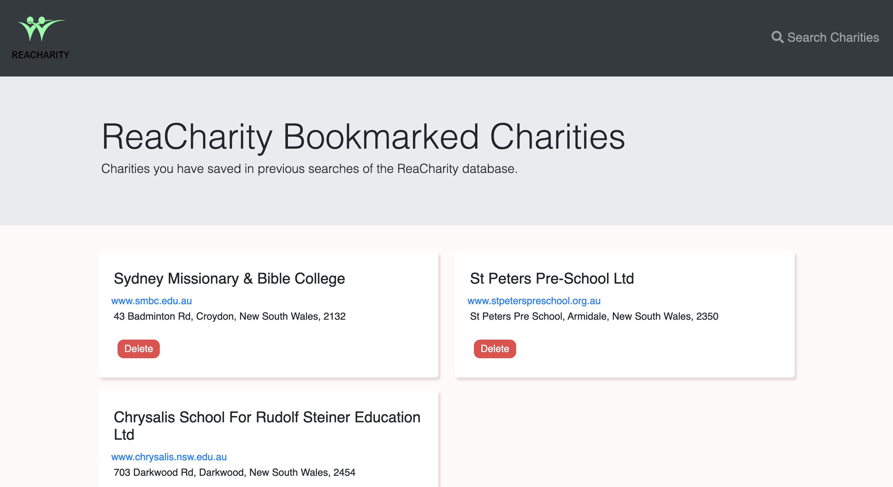

# ReaCharity

## Description

ReaCharity is a website to connect you with nearby charities that focus on issues you care about. Just pick an issue you want to work with and your state and ReaCharity will provide a list tailored for you.

## Technology

- [Bootstrap](https://getbootstrap.com)
- [JQuery](https://jquery.com)
- [data.gov.au ACNC Registered Charities API](https://data.gov.au/dataset/ds-dga-b050b242-4487-4306-abf5-07ca073e5594/details)
- [mapbox](https://www.mapbox.com)
- [Google Maps](https://www.google.com/maps)

## Screenshot

## Link

[This is the link to the deployed application](https://samuelheal.github.io/ReaCharity/)